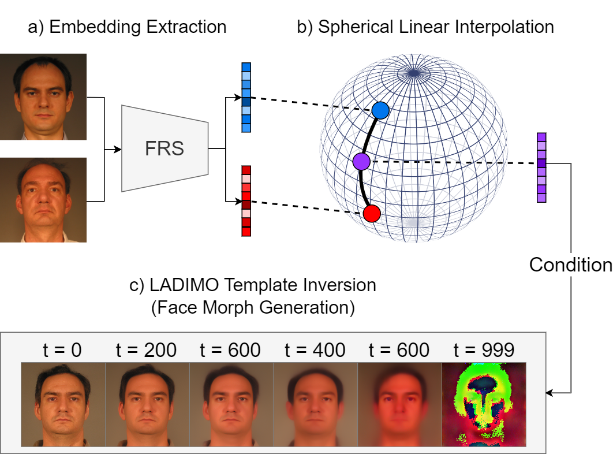

<!-- # LADIMO -->
<h1 align="center"> LADIMO: Face Morph Generation through Biometric Template Inversion with Latent Diffusion</h1>
<p align="center">

  <p align="center">
    <a href="https://dasec.h-da.de/staff/marcel-grimmer/"><strong>Marcel Grimmer</strong></a>    
    ·
    <a href="https://dasec.h-da.de/staff/christoph-busch/"><strong>Christoph Busch</strong></a>

  </p>
  <h2 align="center">International Joint Conference on Biometrics 2024 </h2>
  <div align="center">
  </div>

Please contact Christoph Busch (christoph.busch@h-da.de) to receive the official code and pre-trained models.

<p align="center"> 

</p>

## Citation 

If you use this work in your publication, please cite the following publications:

```
@inproceedings{LADIMO:IJCB:2024,
  title = {{LADIMO}: {F}ace Morph Generation through Biometric Template Inversion with Latent Diffusion},
  author = {Grimmer, Marcel and Busch, Christoph},
  journal = {arXiv preprint arXiv:2308.09963}
  year = {2024}
}
```
As LADIMO is based on Latent Diffusion Models and MagFace, please further cite:
```
@inproceedings{LDM:CVPR:2022,
  title = {High-resolution image synthesis with latent diffusion models},
  author = {Rombach, Robin and Blattmann, Andreas and Lorenz, Dominik and Esser, Patrick and Ommer, Bj{\"o}rn},
  booktitle = {Proceedings of the IEEE/CVF conference on computer vision and pattern recognition},
  pages = {10684--10695},
  year = {2022}
}
```
```
@article{MagFace:CVPR:2021,
  title={Magface: A universal representation for face recognition and quality assessment},
  author={Meng, Qiang and Zhao, Shichao and Huang, Zhida and Zhou, Feng},
  booktitle = {Proceedings of the IEEE/CVF conference on computer vision and pattern recognition},
  pages={14225--14234},
  year={2021}
}
```


